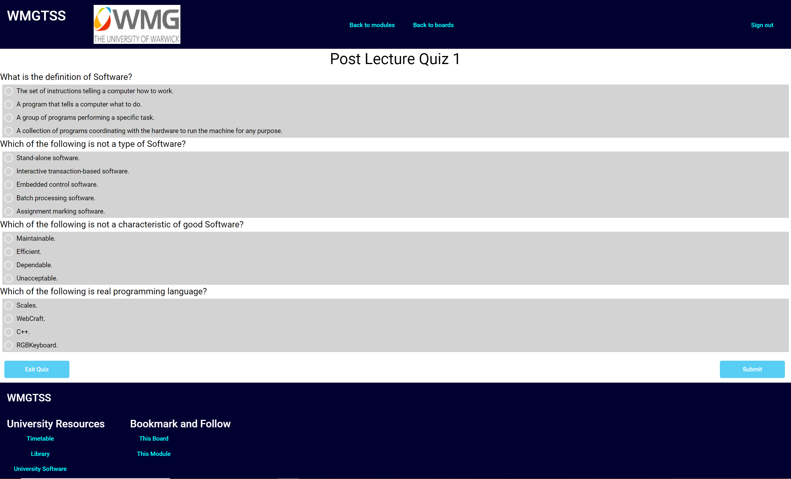

# WMGTSS Quiz Board Implementation

A functional prototpye of the WMG Teaching Support System. This implementation focuses of the Quiz board function within the WMG system.

## About the Project

## Built With

 * Angular
 * Angular Material UI
 * TypeScript
 * RxJS
 * d3
 * Karma
 * Jasmine
 * Cypress

## Getting Started

### Prerequisites

 * Preferred Web Broswer (Chrome recommmended)
 * Nodejs

### Setup (Windows 10)

The following steps run the application in on a dev server.
 
 * Download repository (Clone repo if you are unable to download)
 * Open a new command line window
 * Navigate to the repository's directory
   * Example: C:\Users\username\WM393-A2
 * Run the following command: npm install
 * Run the following command: ng serve
 * Open a web browser of you choice
 * The terminal output will tell you which port to navigate to:
   * Type into the URL search bar: http://localhost:portname (usually 4200)

### Cypress Testing

The following steps are for running the Cypress test script for this application.

If not done so already:

 * Download repository (Clone repo if you are unable to download)
 * Open a new command line window
 * Navigate to the repository's directory
   * Example: C:\Users\username\WM393-A2
 * Run the following command: npm install

For running Cypress after an ng serve:

 * Navigate to the repository's directory
   * Example: C:\Users\username\WM393-A2
 * Run the following command: ng run my-app:cypress-open
 * In the Cypress window that opens click the spec.ts file to run the test script.

## User Accounts

### Tutor

Email: tutor@gmail.com
Password: Password

### Students
#### Student 1

Email: student1@gmail.com
Password: Password

#### Student 2

Email: student2@gmail.com
Password: Password

#### Student 3

Email: student3@gmail.com
Password: Password